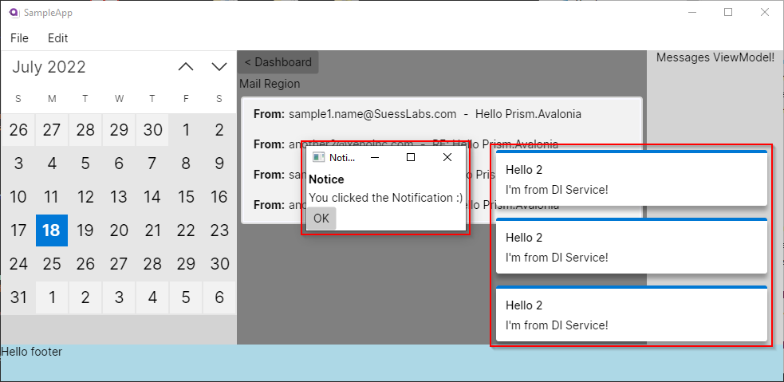

# Prism.Avalonia

[Prism.Avalonia](https://github.com/AvaloniaCommunity/Prism.Avalonia) provides your cross-platform [Avalonia](https://avaloniaui.net/) apps with [Prism framework](https://github.com/PrismLibrary/Prism) support so you can **Navigate**, create **Dialog Windows** and **Notifications**, provide **Dependency Injection** and internal **Messaging** easier than before!  You will need both packages installed to get started.

> **Announcement!**
>
> * **NEW:**_[Official Prism.Avalonia Templates arrived!](https://github.com/SuessLabs/Prism.Avalonia.Templates)_
> * _Prism.Avalonia v9.0.401-pre - **Available!**_
> * _Prism.Avalonia v9.0.537 - **Coming Soon!**_
> * _Support for Avalonia v11.1.x has arrived!_
> * Follow the [Upgrading to Prism v9.0.x-pre](https://github.com/AvaloniaCommunity/Prism.Avalonia/wiki/Upgrading-to-Prism-v9.0) guide for breaking changes

**For more samples outside of this repo, check out:**

* [Avalonia Outlookish](https://github.com/DamianSuess/Learn.PrismAvaloniaOutlookish)
* [Learn PrismLibrary](https://github.com/DamianSuess/Learn.PrismLibrary)
* _If you have samples, let us know and we'll feature them!_

<!--  -->


With Prism.Avalonia's logic and development approach being **similar** to that of [Prism for WPF](https://github.com/PrismLibrary/Prism/), so you can get started right away! Keep in mind, they are **similar** and not 1-to-1. Check out our [Wiki](https://github.com/AvaloniaCommunity/Prism.Avalonia/wiki) and [Avalonia Outlookish](https://github.com/DamianSuess/Learn.PrismAvaloniaOutlookish) app for tips and tricks.

This project currently supports cross-platform Desktop applications (_Windows, Linux, Mac_). Support for Android, iOS, and web apps is still under evaluation; and is not 100%. Feel free to contribute to improve this. 😃

## Package Releases

Just like _Prism.WPF or Prism.Maui_, your project must reference both the **Prism.Avalonia** (_Core_) and **Prism.DryIoc.Avalonia** (_IoC container_) packages to work.

| Package | Stable | Preview
|-|-|-|
| Prism.Avalonia | [](https://www.nuget.org/packages/Prism.Avalonia/) | [](https://www.nuget.org/packages/Prism.Avalonia/)
| Prism.DryIoc.Avalonia | [](https://www.nuget.org/packages/Prism.DryIoc.Avalonia/) | [](https://www.nuget.org/packages/Prism.DryIoc.Avalonia/)

### Version Notice

Choose the NuGet package version that matches your Avalonia version.

Our [versioning schema](https://github.com/AvaloniaCommunity/Prism.Avalonia/wiki/Versioning-Schema) is based on the [SemVer](https://semver.org/) using the format  `MAJOR.MINOR.PATCH.REVISION`. The `REVISION` segment indicates the Avalonia version support. For instance `v8.1.97.11073` equates to, Prism `v8.1.97`, Avalonia `v11.0.7`, _revision_ `3`.

| Prism | Avalonia | Prism.Avalonia NuGet Package
|-|-|-
| v9.0.401-pre  | **11.1.1**    | v9.0.401.11110-pre ([Core](https://www.nuget.org/packages/Prism.Avalonia/9.0.401.11110-pre)) ([DryIoc](https://www.nuget.org/packages/Prism.DryIoc.Avalonia/9.0.401.11110-pre))
| v9.0.401-pre  | **11.0.7**    | v9.0.401.11074-pre ([Core](https://www.nuget.org/packages/Prism.Avalonia/9.0.401.11074-pre)) ([DryIoc](https://www.nuget.org/packages/Prism.DryIoc.Avalonia/9.0.401.11074-pre))
| v9.0.271-pre  | **11.0.7**    | v9.0.271.11000-pre ([Core](https://www.nuget.org/packages/Prism.Avalonia/9.0.271.11000-pre)) ([DryIoc](https://www.nuget.org/packages/Prism.DryIoc.Avalonia/9.0.271.11000-pre))
| v8.1.97       | **11.0.7**  | v8.1.97.11073 ([Core](https://www.nuget.org/packages/Prism.Avalonia/8.1.97.11073)) ([DryIoc](https://www.nuget.org/packages/Prism.DryIoc.Avalonia/8.1.97.11073))
| v8.1.97       | **0.10.21** | v8.1.97.1021 ([Core](https://www.nuget.org/packages/Prism.Avalonia/8.1.97.1021)) ([DryIoc](https://www.nuget.org/packages/Prism.DryIoc.Avalonia/8.1.97.1021))

Be sure to check out the [ChangeLog.md](ChangeLog.md) and guides when upgrading your NuGet packages:

* [Upgrading to Prism v9.0.x-pre](https://github.com/AvaloniaCommunity/Prism.Avalonia/wiki/Upgrading-to-Prism-v9.0)
* [Upgrading to Avalonia-11](Upgrading-to-Avalonia-11.md)
* Also, the official [Avalonia Upgrading from v0.10](https://docs.avaloniaui.net/docs/next/stay-up-to-date/upgrade-from-0.10).

## Contributing

See also, [Contributing.md](.github/Contributing.md)

Prism.Avalonia is an open-source project under the MIT license. We encourage community members like yourself to contribute.

You can contribute today by creating a **feature request**, **issue**, or **discussion** on the forum. From there we can have a brief discussion as to where this fits into the backlog priority. If this is something that fits within the Prism architecture, we'll kindly ask you to create a **Pull Request**. Any PR made without first having an issue/discussion may be closed.

Issues posted without a description may be closed immediately. Use the discussion boards if you have a question, not Issues.

## Install

Add the Prism.Avalonia and its DryIoc packages to your project:

```powershell
# Latest Preview Release
Install-Package Prism.Avalonia -Version 9.0.401.11110-pre
Install-Package Prism.DryIoc.Avalonia -Version 9.0.401.11110-pre

# Avalonia v11 (GA)
Install-Package Prism.Avalonia -Version 8.1.97.11073
Install-Package Prism.DryIoc.Avalonia -Version 8.1.97.11073

# Avalonia v0.10.1021
Install-Package Prism.Avalonia -Version 8.1.97.1021
Install-Package Prism.DryIoc.Avalonia -Version 8.1.97.1021
```

## How to use

### App.xaml.cs

```csharp
public class App : PrismApplication
{
    public static bool IsSingleViewLifetime =>
        Environment.GetCommandLineArgs()
            .Any(a => a == "--fbdev" || a == "--drm");

    public static AppBuilder BuildAvaloniaApp() =>
        AppBuilder
            .Configure<App>()
            .UsePlatformDetect();

    public override void Initialize()
    {
        AvaloniaXamlLoader.Load(this);
        base.Initialize();              // <-- Required
    }

    protected override void RegisterTypes(IContainerRegistry containerRegistry)
    {
        // Register Services
        containerRegistry.Register<IRestService, RestService>();

        // Views - Generic
        containerRegistry.Register<MainWindow>();

        // Views - Region Navigation
        containerRegistry.RegisterForNavigation<DashboardView, DashboardViewModel>();
        containerRegistry.RegisterForNavigation<SettingsView, SettingsViewModel>();
        containerRegistry.RegisterForNavigation<SidebarView, SidebarViewModel>();
    }

    protected override AvaloniaObject CreateShell()
    {
        if (IsSingleViewLifetime)
            return Container.Resolve<MainControl>(); // For Linux Framebuffer or DRM
        else
            return Container.Resolve<MainWindow>();
    }

    protected override void ConfigureModuleCatalog(IModuleCatalog moduleCatalog)
    {
        // Register modules
        moduleCatalog.AddModule<Module1.Module>();
        moduleCatalog.AddModule<Module2.Module>();
        moduleCatalog.AddModule<Module3.Module>();
    }

    /// <summary>Called after <seealso cref="Initialize"/>.</summary>
    protected override void OnInitialized()
    {
      // Register initial Views to Region.
      var regionManager = Container.Resolve<IRegionManager>();
      regionManager.RegisterViewWithRegion(RegionNames.ContentRegion, typeof(DashboardView));
      regionManager.RegisterViewWithRegion(RegionNames.SidebarRegion, typeof(SidebarView));
    }
}
```

### Program.cs

Your default Avalonia `Program.cs` file does not need to be modified. Below is provided as a sample.

```csharp
public static class Program
{
    public static AppBuilder BuildAvaloniaApp() =>
        AppBuilder.Configure<App>()
            .UsePlatformDetect()
            .With(new X11PlatformOptions
            {
                EnableMultiTouch = true,
                UseDBusMenu = true
            })
            .With(new Win32PlatformOptions())
            .UseSkia()
            .UseReactiveUI()
            .UseManagedSystemDialogs();

    static int Main(string[] args)
    {
        double GetScaling()
        {
            var idx = Array.IndexOf(args, "--scaling");
            if (idx != 0 && args.Length > idx + 1 &&
                double.TryParse(args[idx + 1], NumberStyles.Any, CultureInfo.InvariantCulture, out var scaling))
                return scaling;
            return 1;
        }

        var builder = BuildAvaloniaApp();
        InitializeLogging();
        if (args.Contains("--fbdev"))
        {
            SilenceConsole();
            return builder.StartLinuxFbDev(args, scaling: GetScaling());
        }
        else if (args.Contains("--drm"))
        {
            SilenceConsole();
            return builder.StartLinuxDrm(args, scaling: GetScaling());
        }
        else
            return builder.StartWithClassicDesktopLifetime(args);
    }

    static void SilenceConsole()
    {
        new Thread(() =>
        {
            Console.CursorVisible = false;
            while (true)
                Console.ReadKey(true);
        })
        { IsBackground = true }.Start();
    }
}
```

## House Keeping

### Branching Strategy

Below is a basic branching hierarchy and strategy.

| Branch | Purpose
|-|-|
| `master`    | All releases are tagged published using the `master` branch
| `develop`   | The **default** & active development branch. When a feature set is completed and ready for public release, the `develop` branch will be merged into `master` and a new NuGet package will be published.
| `feature/*` | New feature branch. Once completed, it is merged into `develop` and the branch must be deleted.
| `stable/*`  | Stable release base build which shares cherry-picked merges from `develop`. This branch **must not** be deleted.

### Code of Conduct

See, [Code of Conduct](.github/Code-of-Conduct.md)

### Security

See, [Security](.github/Security.md)

**Sponsored by:** [Suess Labs](https://suesslabs.com) a subsidary of Xeno Innovations, Inc.
